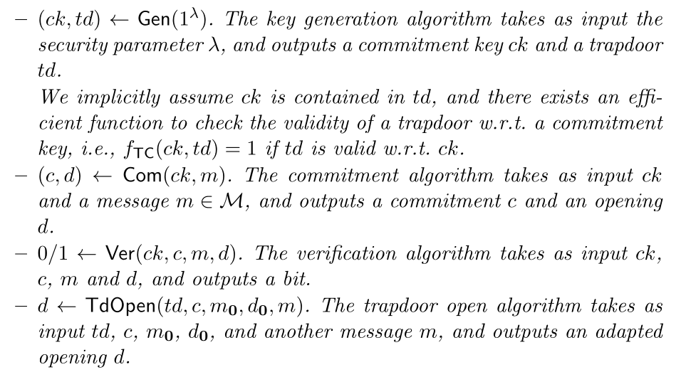
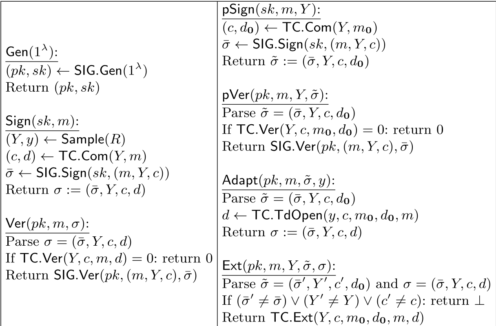

# generic-adaptor-signature-from-trapdoor-commitment
Generic construction of adaptor signatures from signatures and trapdoor commitments.

Follow the paper [*Adaptor Signatures: New Security Definition and A Generic Construction for NP Relations*](https://eprint.iacr.org/2024/1051)

